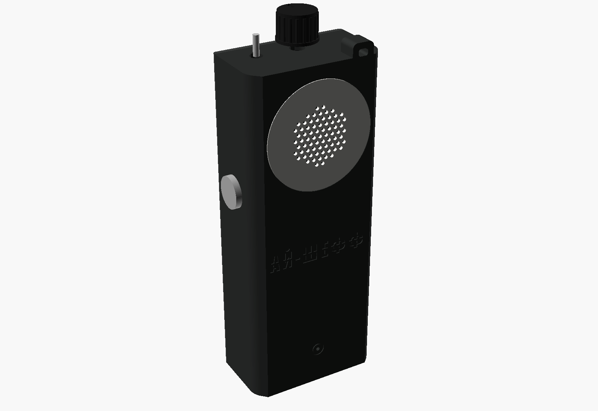
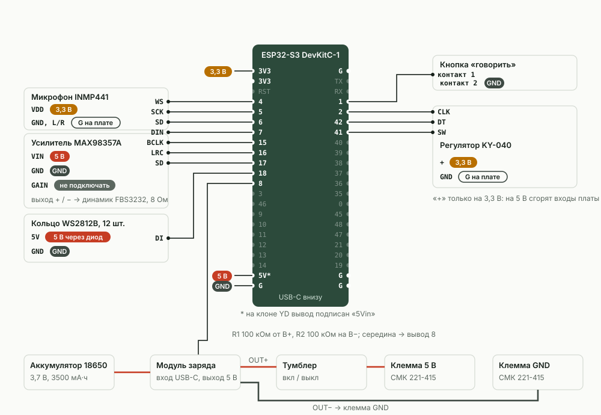

**Русский** · [English](en/BUILD.md)

# Сборка рации

От покупки деталей до закрытой крышки. Прошивка, Wi-Fi и мост описаны отдельно: [Прошивка и настройка](SETUP.md) и [Свой мост](BRIDGE.md).



Рация — брусок 68 × 38 × 170 мм:

- **спереди** — динамик за белым диском; сквозь диск, вокруг решётки динамика, светится кольцо из 12 светодиодов; внизу — отверстие микрофона;
- **на левом боку** (если смотреть спереди) — кнопка «говорить»;
- **сверху** — регулятор громкости, тумблер «вкл/выкл» и ушко для шнурка;
- **снизу** — гнездо USB-C для зарядки.

Всё железо крепится к лицевой части корпуса, задняя крышка — просто крышка: к ней не идёт ни одного провода. Корпус печатается без поддержек. Клея и скотча внутри нет: всё держится на саморезах, защёлках и в пазах. Клей нужен только для белого диска.

**Порядок работ:** купить детали → напечатать корпус → прошить плату → спаять узлы на столе → собрать в корпусе → проверить → закрыть.

Содержание:

1. [Детали на одну рацию](#1-детали-на-одну-рацию)
2. [Печать корпуса](#2-печать-корпуса)
3. [Схема подключения](#3-схема-подключения)
4. [Сборка корпуса](#4-сборка-корпуса)

---

## 1. Детали на одну рацию

Цены — примерные, на сентябрь 2026 года, без доставки. Магазины даны как пример: подойдут такие же детали откуда угодно, лишь бы совпали размеры (список ниже).

| Деталь | Сколько | ≈ Цена | Где купить (пример) |
|---|---|---|---|
| Плата ESP32-S3-DevKitC-1 N16R8, штырьки уже припаяны | 1 | 816 ₽ | [Ozon](https://www.ozon.ru/product/otladochnaya-plata-esp32-s3-devkitc-1-n16r8-wi-fi-bluetooth-usb-c-dlya-arduino-esp-idf-micropython-5648908176/) |
| Микрофон INMP441 (цифровой, круглая плата) | 1 | 600 ₽ | [Ozon](https://www.ozon.ru/product/modul-vsenapravlennogo-mikrofona-na-inmp441-mems-i2s-4314549062/) |
| Усилитель MAX98357A, 3 Вт | 1 | 180 ₽ | [duino.ru](https://duino.ru/usilitel-moshchnosti-3-vt-s-tsap-dac-i-shinoy-i2s/) |
| Динамик FBS3232, 8 Ом, 3 Вт, 32 × 32 мм | 1 | 470 ₽ | [Chip-Dip](https://www.chipdip.ru/product/fbs3232-8-om-3vt-32-32-14.7mm-bez-markirovki-dinamik-fbele-9001621604), код 9001621604 |
| Кольцо WS2812B на 12 светодиодов, Ø50 мм | 1 | 466 ₽ | [Ozon](https://www.ozon.ru/product/koltso-iz-12-adresnyh-svetodiodov-ws2812b-714069208/) |
| Регулятор KY-040 (поворотный энкодер с кнопкой) | 1 | ≈ 113 ₽ (набор из 3 — 338 ₽) | [Ozon](https://www.ozon.ru/product/modul-povorotnogo-enkodera-hw-040-ky-040-5v-20-shagov-na-oborot-dlya-arduino-3-sht-1509157901/) |
| Кнопка антивандальная PBS-28B-2, 16 мм | 1 | 260 ₽ | [Chip-Dip](https://www.chipdip.ru/product/pbs-28b-2-d-16-mm-steel-knopka-antivandalnaya-9000219084), код 9000219084 |
| Микротумблер MTS-101 | 1 | 55 ₽ | [Chip-Dip](https://www.chipdip.ru/product/mts-101-on-off-mikrotumbler-spst-3a-250v-20-mom-ruichi-9000344178), код 9000344178 |
| Модуль заряда «Power Bank Mini», вход USB-C, выход 5 В 2 А | 1 | 159 ₽ | [Ozon](https://www.ozon.ru/product/modul-power-bank-mini-s-gnezdom-type-c-5v-2a-arduino-561634064/) |
| Аккумулятор 18650, например EVE INR18650-35V, 3500 мА·ч | 1 | 380 ₽ | [Chip-Dip](https://www.chipdip.ru/product/eve-inr18650-35v-akkumulyator-li-ion-18650-3500mah-10a-9001581130), код 9001581130 |
| Держатель 1 × 18650 с проводами | 1 | 79 ₽ | [Chip-Dip](https://www.chipdip.ru/product/kls5-18650-l-fc1-5216-batareynyy-otsek-1x18650-9000296086), код 9000296086 |
| Клемма СМК 221-415 на 5 проводов | 2 | 33 ₽ × 2 | [Chip-Dip](https://www.chipdip.ru/product/smk-221-415-klemma-stroitelno-montazhnaya-5pin-kvt-9001187576), код 9001187576 |
| Провода мама-мама 20 см, набор 40 шт. | 1 набор (уходит ≈ 30) | 211 ₽ (цена при покупке от 3 наборов) | [Chip-Dip](https://www.chipdip.ru/product/soedinitelnye-provoda-mama-mama-40-sht-20-sm-shleyf-iz-9001322249), код 9001322249 |
| Резистор 100 кОм, 0,25 Вт | 2 | 6 ₽ × 2 | [Chip-Dip](https://www.chipdip.ru/product/cf-25-s1-4-0.25vt-100-kom-5-rezistor-uglerodistyy-9549), код 9549 |
| Диод 1N4007 | 1 | 6 ₽ | [Chip-Dip](https://www.chipdip.ru/product/1n4007-diod-vypryamitelnyy-1a-1000v-do-41-do-204ac-diotec-9000461664), код 9000461664 |
| Шуруп потайной 3 × 12: 4 на крышку + 2 на держатель аккумулятора | 6 (пачка 40 шт.) | 45 ₽ за пачку | [Chip-Dip](https://www.chipdip.ru/product/0125030012p300004010-shurup-po-derevu-potay-shlits-steelrex-9000688284), код 9000688284 |
| Саморез 3 × 10 по дереву или пластику: полка, лапка платы, планка микрофона | 5 | — | любой крепёжный магазин |
| Термоусадка, набор трубок разного диаметра | ≈ 10 кусочков по 15 мм | 150 ₽ за набор | [Chip-Dip](https://www.chipdip.ru/product/xbt-universal-nabor-termousadochnoy-trubki-100m-21-sht-xibo-9002098269), код 9002098269 |
| Пластик PLA на корпус + белый PLA или PETG на диск динамика | ≈ 145 г | ≈ 220 ₽ (при 1 500 ₽ за кг) | любой |
| Стяжки 2,5 мм — по желанию, для пучка проводов | 2 | — | любой |

**Итого ≈ 4 200 ₽ на рацию**, если собирать сразу три (наборы и пачки делятся на три). Одна рация отдельно — ≈ 4 500 ₽: регулятор, термоусадка и шурупы продаются наборами. Саморезы 3 × 10 и стяжки в сумму не входят.

### Что важно при покупке

Корпус рассчитан под конкретные размеры. Если ваша деталь другая — сравните с этим списком. Не совпадает: поправьте число в шапке [`cad/radio_handheld.scad`](../cad/radio_handheld.scad) и выгрузите STL заново (см. [раздел 2](#если-нужно-поменять-корпус)).

- **Плата ESP32-S3.** Гнездо — под плату 63 × 28 мм с двумя рядами по 22 штырька (клон YD-ESP32-S3; у него вывод 5V подписан «5Vin»). Прошивке хватает флеш-памяти от 4 МБ, так что подойдёт и N8, и N16R8. Номера выводов у оригинальной DevKitC-1 и у клонов одинаковые.
- **Микрофон INMP441** — круглая плата Ø13,4 мм, два столбика по 3 штырька: SD·VDD·GND и SCK·WS·L/R.
- **Усилитель MAX98357A** — плата 17,3 × 18,8 мм, без винтового клеммника.
- **Динамик** — фланец 32 × 32 мм, глубина 14,7 мм, магнит Ø27,3 мм.
- **Кольцо WS2812B** — Ø50 мм снаружи, Ø36 мм внутри, толщина с ламельками 2,5 мм.
- **Регулятор KY-040** — втулка M7 с резьбой 12 мм, вал Ø5,8 мм с лыской (плоским срезом) 4,2 мм. У вала с мелкой насечкой вместо лыски ручку придётся подгонять.
- **Тумблер MTS-101** — резьба M6, корпус под панелью 14 × 12,7 × 7,8 мм.
- **Кнопка PBS-28B-2** — резьба M16, внутри корпуса занимает Ø14,6 × 20,3 мм, контакты под винт.
- **Модуль заряда** — 20 × 26 × 4 мм, гнездо USB-C на коротком краю. Внутри он устроен как пауэрбанк: если рация берёт совсем мало тока, модуль может решить, что нагрузку отключили, и выключить питание. Поэтому «Экономия аккумулятора» в настройках рации по умолчанию выключена — без нужды её не включайте.
- **Держатель 18650** — 77,5 × 20,5 × 21 мм, в дне два отверстия Ø3 на расстоянии 55 мм.
- **Клеммы СМК 221-415** — 19,4 × 29,8 × 9,6 мм.

### Инструменты

- паяльник 40–60 Вт, припой с флюсом;
- мультиметр;
- бокорезы, канцелярский нож, круглый надфиль — подчистить отверстия после печати;
- крестовая отвёртка Pz1;
- прозрачный клей: «Момент Кристалл» или секундный (не термоклей) — для белого диска;
- фен, а на крайний случай зажигалка — для термоусадки;
- кабель USB-C с передачей данных (не только зарядный) — для прошивки;
- любая зарядка USB-C — заряжать рацию.

---

## 2. Печать корпуса

Все STL лежат в папке [`stl/`](../stl). STL — это файл с 3D-формой детали, его открывает слайсер (программа, которая «нарезает» модель на слои для принтера). Детали уже повёрнуты так, как их надо класть на стол: **не поворачивайте их**. Поддержки не нужны.

### Обязательные детали — на одну рацию

| Файл | Что это | Как лежит на столе | Размер, мм | ≈ г |
|---|---|---|---|---|
| [`front.stl`](../stl/front.stl) | **Лицевая часть**: лицо, бока, верх и низ одной деталью; внутри гнёзда и стойки для всего железа | лицом на стол | 68 × 177 × 36 | 89 |
| [`back.stl`](../stl/back.stl) | **Задняя крышка**, 4 потайных шурупа 3 × 12 | наружной стороной на стол | 68 × 170 × 4 | 32 |
| [`shelf.stl`](../stl/shelf.stl) | **Полка за динамиком**: прижимает динамик вместе с кольцом и диском, держит обе клеммы; 2 самореза 3 × 10 | плитой на стол | 60 × 32 × 7 | 9 за все четыре |
| [`spk_puck.stl`](../stl/spk_puck.stl) | **Шайба динамика**: давит на магнит, штырьком входит в отверстие полки | плашмя | Ø20 × 5 | ↑ |
| [`dk_arm.stl`](../stl/dk_arm.stl) | **Лапка платы ESP**: прижимает плату посередине; 1 саморез 3 × 10 | планкой на стол | 24 × 12 × 12 | ↑ |
| [`mic_cap.stl`](../stl/mic_cap.stl) | **Планка микрофона**: ложится между столбиками его штырьков; 2 самореза 3 × 10 | планкой на стол | 6,5 × 40 × 9 | ↑ |
| [`spacer.stl`](../stl/spacer.stl) | **Прокладка** между кольцом светодиодов и динамиком | плашмя | Ø50 × 3 | 7 за обе |
| [`knob.stl`](../stl/knob.stl) | **Ручка регулятора** | верхом на стол | Ø20 × 14 | ↑ |
| [`lens.stl`](../stl/lens.stl) | **Диск динамика.** Печатайте **белым**: через него светит кольцо | плашмя | Ø54 × 1,6 | 4,5 |

Комплект корпуса без диска — **≈ 140 г пластика и ≈ 5 ч 45 мин** на Bambu Lab P2S (профиль «0.16mm High Quality», время вместе с разогревом и калибровкой стола). На столе 256 × 256 мм весь комплект печатается за один раз; самой длинной детали — лицевой части — нужен стол от 180 мм.

### Пробники — по желанию

Печатать их не обязательно, но они быстро покажут, подходит ли ваш принтер и ваши детали, до того как уйдут 5–6 часов на корпус.

| Файл | Что проверяет |
|---|---|
| [`edge_test.stl`](../stl/edge_test.stl) | Кусок лицевой части 68 × 36 × 12 мм со скруглённым ребром и надписью: как ваш принтер печатает ребро у лица и трафаретные буквы. |
| [`shaft_gauge.stl`](../stl/shaft_gauge.stl) | Пробник вала регулятора: три D-образных отверстия, номера 1, 2, 3 вырезаны сверху. № 1 — Ø6,2 с лыской 4,6; № 2 — Ø6,35 / 4,75; № 3 — Ø6,5 / 4,9. Ручка `knob.stl` сделана под № 2. Если плотно, но без усилия садится другое отверстие — впишите его числа в `shaft_d` и `shaft_flat` в `cad/radio_handheld.scad` и выгрузите ручку заново. |
| [`coupon.stl`](../stl/coupon.stl) | Пластина 84 × 72 × 2,4 мм с отверстиями под диск динамика, кнопку, тумблер, регулятор и микрофон: примерить покупные детали. |
| [`enc_spacer.stl`](../stl/enc_spacer.stl) | 6 колец-проставок толщиной 3 мм (на три рации). Запасные: нужны, только если у вашего регулятора резьба втулки длиннее обычной. Кольцо надевается на втулку изнутри корпуса, между регулятором и стенкой. |

Пробник ребра, пробник вала и ручка вместе — ≈ 16 г и ≈ 47 мин.

### Настройки печати

- пластик — PLA, цвет корпуса любой; диск динамика — **белый** PLA или PETG;
- сопло 0,4 мм, слой **0,16 мм**;
- **3 стенки**, заполнение **15 %**;
- поддержки **выключены**;
- лист — текстурный PEI: его узор ляжет на лицо рации. Подойдёт и гладкий лист.

У лапки платы и планки микрофона снизу есть «ушки» толщиной в один слой: они держат мелкую деталь на столе, после печати их отломите. Если планка микрофона всё равно отрывается от стола, напечатайте её отдельно с каймой (brim) 5 мм.

Отверстия в стенках под кнопку, регулятор и тумблер сделаны «капелькой» с острым концом к спине: при печати лицом вниз их верх не провисает. Если резьбовая втулка входит туго, пройдите отверстие круглым надфилем.

### Нарезка из командной строки (Bambu Studio)

Если у вас macOS, Bambu Studio в папке «Программы» и принтер Bambu Lab P2S, скрипт [`tools/make_print.sh`](../tools/make_print.sh) сам нарежет готовые столы:

```bash
tools/make_print.sh                    # все столы → папка print/
ONLY=1_ tools/make_print.sh            # только столы, в имени которых есть «1_»
PROFILE="0.16mm Standard @BBL P2S" tools/make_print.sh   # другой профиль печати
```

Получатся файлы `print/*.3mf` с оценкой времени и граммов: `0_пробник_кромки_вала`, `1_рация_v3_комплект`, `2_планка_микрофона_x2` (с каймой), `3_белый_диск_x3`, `4_рация_белая_комплект_с_диском`. Откройте нужный файл в Bambu Studio и отправьте на печать. С другим принтером или слайсером просто откройте STL из `stl/` и выставьте настройки из списка выше.

### Если нужно поменять корпус

Корпус — параметрическая модель [OpenSCAD](https://openscad.org) в одном файле: [`cad/radio_handheld.scad`](../cad/radio_handheld.scad). Все размеры покупных деталей и их места — числами в шапке файла. Нужна свежая сборка OpenSCAD (snapshot) с движком Manifold. Надпись на лице набрана шрифтом Impact: если его нет в системе, OpenSCAD подставит другой, и трафаретные перемычки букв могут съехать.

Выгрузить STL заново (из корня проекта):

```bash
for p in front back shelf spk_puck dk_arm mic_cap knob; do
  openscad --backend manifold --export-format binstl -D "part=\"${p}_print\"" -o "stl/$p.stl" cad/radio_handheld.scad
done
for p in lens spacer shaft_gauge coupon edge_test; do
  openscad --backend manifold --export-format binstl -D "part=\"$p\"" -o "stl/$p.stl" cad/radio_handheld.scad
done
openscad --backend manifold --export-format binstl -D 'part="enc_spacer_print"' -o stl/enc_spacer.stl cad/radio_handheld.scad
```

После любой правки прогоните четыре проверки модели: `check_inside` (детали не задевают друг друга), `check_walls` (детали не лезут в стенки), `check_lid` (крышка входит на место), `check_parts` (прижимные детали никуда не врезаются). Каждая должна дать **пустой** результат — OpenSCAD сообщит, что объект пустой:

```bash
for c in check_inside check_walls check_lid check_parts; do
  openscad --backend manifold -D "part=\"$c\"" -o check.stl cad/radio_handheld.scad
done
```

Замеры деталей, по которым построена модель, — в [`cad/measurements.md`](../cad/measurements.md).

---

## 3. Схема подключения



**Как читать схему.** Номера у платы — как подписаны на самой плате, если держать её **надписями к себе, разъёмами USB вниз**: левый ряд начинается с 3V3, правый — с G. «Вывод 4» — это штырёк с подписью «4», а не четвёртый по счёту. Метки у выводов питания: «5 В» и «GND» — провод идёт в клемму, «3,3 В» — на штырёк 3V3 платы (их два), «G на плате» — на штырёк G самой платы, **не в клемму**.

Почти все сигнальные провода — **провода мама-мама**: у них на концах пластиковые колодки, которые надеваются на штырёк, без пайки. Паяются только детали без штырьков: провода держателя аккумулятора, модуль заряда, кольцо, тумблер, динамик, диод и два резистора делителя. А ещё гребёнки штырьков (полоски штырьков) на микрофон и усилитель, если продавец их не припаял.

### Выводы платы

Источник правды — [`firmware/walkie/config.h`](../firmware/walkie/config.h). Поменяли провод — поменяйте номер и там, и пересоберите прошивку.

| Вывод платы | Куда | Зачем |
|---|---|---|
| 4 | микрофон WS | I2S — цифровая шина звука из трёх проводов; WS — такт «левый/правый канал» |
| 5 | микрофон SCK | I2S, такт битов |
| 6 | микрофон SD | I2S, данные с микрофона |
| 7 | усилитель DIN | I2S, данные на динамик |
| 15 | усилитель BCLK | I2S, такт битов |
| 16 | усилитель LRC | I2S, такт каналов |
| 17 | усилитель SD | включение усилителя: прошивка гасит его в тишине, чтобы динамик не шипел |
| 18 | кольцо DI (DIN) | управление светодиодами |
| 1 | кнопка «говорить», контакт 1 | второй контакт кнопки — на GND |
| 2 | регулятор CLK | поворот |
| 42 | регулятор DT | поворот |
| 41 | регулятор SW | нажатие на ручку |
| 8 | середина делителя заряда | прошивка меряет напряжение аккумулятора |
| 3V3 (первый) | микрофон VDD | питание 3,3 В |
| 3V3 (второй) | регулятор «+» | питание **только 3,3 В** |
| G, правый ряд, верхний | микрофон GND | |
| G, правый ряд, предпоследний | микрофон L/R | L/R на землю — микрофон работает в левом канале |
| G, правый ряд, нижний | регулятор GND | |
| 5V (на клоне — 5Vin), левый ряд, предпоследний | клемма 5 В | плата питается от модуля заряда |
| G, левый ряд, нижний | клемма GND | |

### Питание

- Провода держателя аккумулятора: красный → **B+** модуля заряда, чёрный → **B−**.
- Делитель заряда: резистор 100 кОм от **B+** к «середине», второй 100 кОм от «середины» к **B−**, «середина» → вывод **8**.
- **OUT+** модуля заряда → тумблер → **клемма 5 В**.
- **OUT−** модуля заряда → **клемма GND**.

Модуль заряда соединён с аккумулятором всегда, тумблер разрывает только выход 5 В. Поэтому рация заряжается и с выключенным тумблером.

### Клеммы: две общие шины

Клемма СМК 221-415 — соединитель на 5 гнёзд под рычажками. Внутри все гнёзда замкнуты одной медной пластиной: всё, что вставлено в одну клемму, соединено между собой. В рации два таких общих узла, поэтому **клемм на каждую рацию две**:

- **клемма 5 В** — 4 провода, одно гнездо свободно: от тумблера (на нём OUT+ модуля заряда) · 5V платы · Vin усилителя · 5V кольца через диод;
- **клемма GND** — 5 проводов, заполнена: OUT− модуля заряда · G платы (левый ряд, нижний) · GND усилителя · GND кольца · контакт 2 кнопки.

Микрофон и регулятор в клеммы не идут: их земля и питание берутся со штырьков самой платы.

> **Провод 5 В и провод GND никогда не вставляйте в одну клемму.** Это короткое замыкание: модуль заряда отключится или сгорит. Если клемма пока одна — используйте её под GND, а четыре провода 5 В скрутите, пропаяйте и закройте термоусадкой.

**Как вставить тонкий провод в клемму.** Жила провода мама-мама тоньше, чем клемма держит надёжно. Зачистите конец на **20–22 мм**, сложите жилу **вдвое** и плотно скрутите — получится двойной кончик 10–11 мм. Откройте рычажок, вставьте до упора, закройте и подёргайте: провод не должен выходить. Паять кончик не нужно. Без этого рация может сама перезагружаться от тряски, а такую неисправность потом очень трудно найти.

### Делитель заряда

Рация следит за зарядом по выводу 8, а он выдерживает не больше 3,3 В. Аккумулятор даёт до 4,2 В. Два одинаковых резистора по 100 кОм подряд делят напряжение ровно пополам, и в точке между ними не больше 2,1 В. Ток через них ≈ 0,02 мА — аккумулятор они не сажают.

1. Скрутите по одной ножке двух резисторов — это «середина».
2. У провода мама-мама отрежьте один разъём, зачистите 5 мм, подкрутите к середине и пропаяйте все три; сверху термоусадка.
3. Свободную ножку первого резистора припаяйте к площадке **B+** модуля заряда (там же красный провод аккумулятора), второго — к **B−** (там же чёрный).
4. Разъём провода наденьте на штырёк **8** платы, пока плата вне корпуса. Если держать плату надписями к себе, USB вниз, это 12-й штырёк сверху в левом ряду.

У резисторов нет «плюса», их можно ставить любой стороной. Подключайте к **B+ / B−**, не к OUT+. Ножки укоротите бокорезами до 5–8 мм и каждую пайку закройте термоусадкой: голая ножка от B+ не должна касаться других деталей. Без делителя рация работает, но не узнает, что аккумулятор садится.

### Все провода одной рации

Длина — сколько провода нужно по трассе в корпусе, с запасом ≈ 3 см. Провод, который идёт в клемму или на пайку, отрежьте по месту. Провода с разъёмами на обоих концах укоротить нельзя: лишнее сложите у мостика в канале и стяните (можно взять набор мама-мама по 10 см — их уйдёт 9 на рацию).

«Сложить вдвое» — конец, который идёт в клемму: зачистить 20–22 мм и сложить, как описано выше.

| № | Откуда | Куда | Чем | Длина |
|---|---|---|---|---|
| | **Микрофон INMP441** | | | |
| 1 | вывод 4 | WS | провод мама-мама | ≈ 10 см |
| 2 | вывод 5 | SCK | провод мама-мама | ≈ 10 см |
| 3 | вывод 6 | SD | провод мама-мама | ≈ 10 см |
| 4 | 3V3 (первый) | VDD | провод мама-мама | ≈ 10 см |
| 5 | G, правый ряд, верхний | GND | провод мама-мама | ≈ 10 см |
| 6 | G, правый ряд, предпоследний | L/R | провод мама-мама | ≈ 15 см |
| | **Усилитель MAX98357A** (выводы по порядку: LRC, BCLK, DIN, GAIN, SD, GND, Vin) | | | |
| 7 | вывод 7 | DIN | провод мама-мама | ≈ 10 см |
| 8 | вывод 15 | BCLK | провод мама-мама | ≈ 10 см |
| 9 | вывод 16 | LRC | провод мама-мама | ≈ 10 см |
| 10 | вывод 17 | SD | провод мама-мама | ≈ 10 см |
| 11 | клемма 5 В | Vin | провод мама-мама, разъём у клеммы отрезать, сложить вдвое | ≈ 20 см |
| 12 | клемма GND | GND | провод мама-мама, разъём у клеммы отрезать, сложить вдвое | ≈ 20 см |
| 13 | динамик «+» | площадка «+» усилителя | целый провод из набора, разъёмы срезать; пайка с обеих сторон | ≈ 17 см |
| 14 | динамик «−» | площадка «−» усилителя | так же. GAIN никуда не подключается | ≈ 17 см |
| | **Кольцо WS2812B** | | | |
| 15 | вывод 18 | DI (вход) | провод мама-мама, один разъём отрезать, к кольцу — пайка | ≈ 15 см |
| 16 | клемма 5 В | 5V кольца | провод, разъёмы срезать; в разрыв — диод 1N4007 **полоской к кольцу**, пайка + термоусадка; конец в клемму сложить вдвое | ≈ 14 см |
| 17 | клемма GND | GND кольца | провод мама-мама, разъём у клеммы отрезать, сложить вдвое; к кольцу — пайка | ≈ 14 см |
| | **Кнопка «говорить» PBS-28B-2** | | | |
| 18 | вывод 1 | контакт 1 | провод мама-мама, один разъём отрезать; к кнопке — под винт | ≈ 15 см |
| 19 | клемма GND | контакт 2 | провод, разъёмы срезать; к кнопке — под винт, конец в клемму сложить вдвое | ≈ 15 см |
| | **Регулятор KY-040** | | | |
| 20 | вывод 2 | CLK | провод мама-мама, второй разъём — на штырёк регулятора | ≈ 20 см |
| 21 | вывод 42 | DT | так же | ≈ 20 см |
| 22 | вывод 41 | SW | так же | ≈ 20 см |
| 23 | 3V3 (второй) | + | так же — **только 3,3 В** | ≈ 20 см |
| 24 | G, правый ряд, нижний | GND | так же | ≈ 20 см |
| | **Питание платы** | | | |
| 25 | 5V / 5Vin | клемма 5 В | провод мама-мама, разъём у клеммы отрезать, сложить вдвое | ≈ 15 см |
| 26 | G, левый ряд, нижний | клемма GND | провод мама-мама, разъём у клеммы отрезать, сложить вдвое | ≈ 15 см |
| 27 | вывод 8 | середина делителя | провод мама-мама, один разъём отрезать, к резисторам — пайка | ≈ 10 см |
| | **Аккумулятор и зарядка** | | | |
| 28 | держатель 18650, красный | B+ модуля заряда | свой провод держателя, пайка | — |
| 29 | держатель 18650, чёрный | B− модуля заряда | свой провод держателя, пайка | — |
| 30 | B+ модуля заряда | резистор → середина → резистор → B− | пайка выводами резисторов | — |
| 31 | OUT+ модуля заряда | тумблер, один вывод | целый провод, разъёмы срезать; пайка с обеих сторон | ≈ 20 см |
| 32 | тумблер, второй вывод | клемма 5 В | провод, разъёмы срезать; к тумблеру — пайка, конец в клемму сложить вдвое | ≈ 10 см |
| 33 | OUT− модуля заряда | клемма GND | провод, разъёмы срезать; к модулю — пайка, конец в клемму сложить вдвое | ≈ 17 см |

### Где легко ошибиться

- **Регулятор KY-040 — только к 3,3 В.** На модуле стоят резисторы, подтягивающие выводы к его «+». От 5 В на входы платы попадёт лишнее напряжение, и они сгорят.
- **Микрофон — тоже только 3,3 В** (VDD на 3V3).
- **Пропаяйте все шесть штырьков микрофона.** Типичная неисправность — непропаянный SCK: рация передаёт тишину, а мост пишет «в передаче одна тишина — проверьте микрофон».
- **Диод 1N4007 — полоской к кольцу.** Диод снижает питание кольца примерно до 4,3 В, и тогда сигнала 3,3 В с платы ему хватает уверенно. Без диода кольцо может мигать «не теми» цветами.
- **Провод с вывода 18 — на площадку DI (вход) кольца**, не на DO (выход).
- **Минус динамика не соединяйте с GND:** у этого усилителя оба выхода рабочие.
- **Вывод GAIN усилителя оставьте свободным:** громкость задаёт регулятор.
- **Делитель — к B+ / B−,** не к OUT+.
- **Клемма 5 В и клемма GND — две разные клеммы.** Провод 5 В в клемме GND — короткое замыкание.
- **Концы в клеммах — сложенные вдвое.** Одинарная тонкая жила держится плохо.

---

## 4. Сборка корпуса


**Где что.** Всё собирается в лицевой части. Она лежит лицом на столе, а вы смотрите в неё со спины, как на рисунке. Поэтому бок с кнопкой «говорить» на рисунке и на столе — **справа** (хотя спереди он левый). Дальше места названы так: «у бока с кнопкой» и «у другого бока».

На рисунке кружки с крестиком — саморезы: 2 у полки, 1 у лапки платы, 2 у держателя аккумулятора, 2 у планки микрофона. Пустые кружки по углам — стойки под 4 шурупа крышки. Пунктир — то, что спрятано под полкой: динамик и стакан кольца, а вверху — плата регулятора.

### Шаг 1. Прошивка — до сборки

Прошейте и настройте плату, пока она не в корпусе: потом её гнездо USB-C окажется внутри. Как — в [инструкции по прошивке](SETUP.md#1-прошивка). Дальше рация обновляется по воздуху, через мост, либо файлом на своей странице.

**Проверка микрофона на столе (по желанию).** Сначала припаяйте к микрофону гребёнку штырьков (шаг 2, пункт 1). Наденьте на прошитую плату провода 1–6 к микрофону и подключите её кабелем. Откройте монитор порта (например, в Arduino IDE: скорость 115200, конец строки — «Новая строка», иначе команда не выполнится; подробнее — [Команды по USB](SETUP.md#5-команды-по-usb)) и отправьте команду `micraw`. Плата ответит строкой `OK micraw кадров … L: … R: …`. Числа после `L:` должны быть заметно разными и меняться, если хлопнуть рядом. `L: 0…0` или два одинаковых числа — микрофон молчит: проверьте пайку штырьков (чаще всего SCK) и провод L/R → G.

### Шаг 2. Пайка на столе

Всё это делается до установки в корпус: потом к винтам кнопки и к тумблеру уже не подобраться. Термоусадку (кусочек ≈ 15 мм) надевайте на провод **до** пайки, потом её не надеть. После пайки надвиньте трубку на спайку и прогрейте феном или боком жала.

1. **Гребёнки штырьков** на микрофон и усилитель, если продавец их не припаял. У микрофона штырьки — на сторону **без деталей** (там дырочка для звука), у усилителя — на сторону **с деталями**. Хвосты штырьков с обратной стороны откусите. Пропаяйте каждый штырёк.
2. **Динамик:** два целых провода ≈ 17 см от лепестков динамика к площадкам «+» и «−» усилителя (провода 13, 14).
3. **Кольцо:** три провода — DI, 5V с диодом полоской к кольцу, GND (провода 15–17).
4. **Аккумулятор и делитель:** провода держателя — к B+ и B− модуля заряда, к тем же площадкам — делитель заряда (провода 27–30).
5. **Тумблер:** OUT+ модуля — проводом ≈ 20 см к одному выводу тумблера; ко второму выводу — провод, который пойдёт в клемму 5 В; к OUT− — провод ≈ 17 см к клемме GND (провода 31–33).
6. **Кнопка:** два провода под винты (провода 18, 19). Жилу заворачивайте крючком по часовой стрелке — тогда винт её затягивает, а не выталкивает.
7. **Регулятор паять не нужно:** колодки проводов мама-мама надеваются прямо на штырьки, в стенке корпуса для них есть карман. Штырьки не укорачивайте. Если колодки всё же не помещаются — отрежьте их и припаяйте провода прямо к штырькам.

### Шаг 3. Детали в лицевую часть — в таком порядке

Лицевая часть лежит лицом на столе.

1. **Белый диск.** 3–4 капли прозрачного клея (не термоклея) на скос гнезда, затем вдавите диск снаружи, заподлицо с лицом.
2. **Кольцо, прокладка, динамик.** Изнутри в стакан положите **кольцо** светодиодами к диску, площадками с проводами вниз (к плате ESP). Сверху — **прокладку**, вырезом туда же, к площадкам. В её квадратное гнездо — **динамик** фланцем, лепестками вбок. Ничего не клейте: всю стопку потом прижмёт полка.
3. **Регулятор** — в отверстие сверху ближе к середине. Втулку — изнутри, гребёнкой штырьков к другому боку, в свободный угол, подальше от тумблера. Гайку закрутите снаружи.
4. **Тумблер** — в отверстие сверху у бока с кнопкой, поперёк корпуса: рычажок ходит к лицу и к спине.
5. **Кнопка** — в отверстие на боку, гайку изнутри затяните.
6. **Модуль заряда** — в паз внизу у бока с кнопкой: на ребро, гнездом USB-C вниз в окно в дне. Резисторами делителя — к стенке с кнопкой: с этой стороны паз открыт сверху. Провода от его площадок — к вам.
7. **Микрофон** — в колечко внизу посередине, деталями (капсюлем) к лицу. Два столбика штырьков встанут слева и справа от центра. Сначала наденьте на штырьки колодки проводов 1–6, потом положите **планку** между столбиками и вверните 2 самореза 3 × 10 (не длиннее 10 мм, иначе проткнут лицо).
8. **Усилитель** — в гнездо внизу у другого бока, штырьками к вам. Гребёнкой вверх или вниз — как удобнее проводам. Сначала заведите край платы, что у стенки корпуса, под козырёк, потом прижмите другой край (к микрофону): он по скосу проскочит под зуб, стенка там пружинит. Прямо сверху на оба края не давите.
9. **Держатель аккумулятора**, пока без аккумулятора, — на две стойки у другого бока: 2 шурупа 3 × 12 изнутри, через его отверстия в дне (**не длиннее 12 мм**). Поверх держателя провода не кладите: до крышки над ним ≈ 2 мм.
10. **Плата ESP32-S3.** Пока плата в руках (надписями к себе, USB вниз), наденьте разъёмы проводов 1–10, 15, 18, 20–27 — номера выводов сейчас видны. Потом переверните плату модулем к лицу рации и уложите в гнездо у бока с кнопкой **антенной вниз**: сначала заведите два нижних угла под козырьки, потом положите плату на площадки. Ряд с выводами 3V3…8 и 5V окажется у канала для проводов, ряд с выводами 1, 2, 42, 41 — у стенки с кнопкой. На уложенной плате штырьки уже не сосчитать: надписи внизу, ряды поменялись местами. Наденьте **лапку** отверстием на штырёк стойки и вверните 1 саморез 3 × 10 — она прижмёт плату посередине. Вынуть плату можно в любой момент, отвернув этот саморез.
11. **Полка.** Вдавите клеммы в её гнёзда рычажками вверх (к вам), стороной с отверстиями для проводов — к боковым стенкам корпуса: клемму 5 В — в гнездо у стенки с кнопкой (рядом с тумблером), клемму GND — в другое. **Шайбу** положите на магнит динамика плоской стороной, штырьком к себе. Полку наденьте отверстием на штырёк шайбы, поставьте на две стойки у боков и вверните 2 самореза 3 × 10 до упора полки в стойки: шайба прижмёт динамик, а с ним кольцо и белый диск.

> **Антенна** — выступ модуля ESP32-S3 без металлической крышки, он выходит за край платы. Не прижимайте к ней провода и металл и не складывайте рядом лишнюю длину проводов.

### Шаг 4. Провода

Вторые концы — по списку, по номерам. Концы в клеммы — сложенные вдвое. Куда вести:

- микрофон и усилитель — коротко, к ряду выводов платы у канала;
- провода кнопки — вдоль стенки с кнопкой; провода регулятора — поверх платы вверх и через верх к регулятору, мимо края полки у другого бока;
- провода в клеммы подводите вдоль боковых стенок, там у клемм отверстия: к клемме 5 В — вдоль стенки с кнопкой, к клемме GND — вдоль другой стенки. Под полкой у каждого бока есть прорезь для стяжки;
- OUT+ от модуля заряда к тумблеру — вдоль стенки с кнопкой: над колодками платы, над кнопкой и мимо клеммы 5 В. OUT− к клемме GND — наискось поверх платы и канала;
- провода динамика — из-под полки (там зазор над магнитом) в канал и по каналу вниз к усилителю, в обход колодок на его гребёнке;
- пучок в канале стяните у мостиков стяжками 2,5 мм, продев их под мостик. Лишнюю длину складывайте у мостика, а не у антенны (низ платы).

### Шаг 5. Ручка

Насадите ручку на вал с зазором 1,5–2 мм над торцом втулки и нажмите: должен быть щелчок. Это нажатие на регулятор, им выключается звук.

### Шаг 6. Проверка до закрытия

**Мультиметром, пока аккумулятор не вставлен.** В режиме прозвонки коснитесь щупами второго вывода тумблера (того, что идёт в клемму 5 В) и площадки OUT− модуля заряда. Короткий писк и тишина — нормально: заряжаются конденсаторы. Непрерывный писк — где-то замыкание; первым делом ищите провод 5 В в клемме GND.

**Мультиметром, с аккумулятором.** Вставьте аккумулятор, плюс — по метке на держателе. На площадках B+ и B− модуля заряда должно быть 3,0–4,2 В, а на середине делителя — ровно половина.

**Включите тумблер** (не загорелось — щёлкните в другую сторону). Кольцо сразу вспыхнет **белым**. Дальше:

- рация, которая ещё не знает Wi-Fi, сразу начнёт медленно «дышать» **фиолетовым**: открыта точка настройки RADIO-XXXX. Так и должно быть, Wi-Fi вводится с телефона (см. [Способ 2. С телефона](SETUP.md#способ-2-с-телефона));
- рация, которая уже знает Wi-Fi, покажет бегущий **синий** огонёк (ищет сеть), а на связи с мостом прозвучит «ти-ду» и пойдут короткие **зелёные** вспышки раз в 3 секунды.

Пока крышка открыта, за минуту проверьте то, что потом спрячется. Связь с мостом для этого не нужна:

| Что сделать | Что должно быть | Что это проверяет |
|---|---|---|
| Покрутить регулятор | кольцо показывает громкость белой полосой, в динамике щелчки; по часовой — громче | регулятор, усилитель, динамик |
| Коротко нажать на ручку | полоса становится фиолетовой — звук выключен; ещё нажатие — щелчок, звук снова есть | кнопку регулятора |
| Нажать кнопку «говорить» без связи с мостом | низкий гудок и быстрое оранжевое мигание («связи нет, говорить нельзя») | кнопку «говорить» |
| Подержать ручку 1–4 с и отпустить | шкала заряда: зелёная (больше 40 %), янтарная (16–40 %) или красная (15 % и меньше). Первые 20 секунд после включения — тусклый белый: заряд ещё измеряется | делитель заряда |

Когда рация на связи с мостом, проверьте и микрофон: нажмите кнопку — «пи-пи», кольцо загорится красным и будет «плясать» в такт голосу. Другая рация вас услышит, а на странице моста эта рация будет отмечена как говорящая.

**Если что-то не так:**

| Признак | Что проверить |
|---|---|
| Кольцо не загорелось ни разу за 10 секунд | тумблер, провода в клемме 5 В, диод (полоской к кольцу), провод с вывода 18 на DI, а не на DO |
| Кольцо мигает «не теми» цветами | диод в проводе 5V кольца, GND кольца в клемме GND |
| Нет щелчков и звуков | Vin и GND усилителя в клеммах, провода 7–10 на выводах 7, 15, 16, 17, провода динамика на «+» и «−» усилителя |
| Громкость меняется наоборот | поставьте галочку «Регулятор крутится наоборот» на странице рации или поменяйте местами провода CLK и DT |
| Регулятор не откликается | «+» регулятора на 3V3, его GND на G платы, провода на выводах 2, 42, 41 |
| На шкале заряда синий цвет, хотя рация на аккумуляторе | рация не видит делитель: провод 27 на выводе 8, резисторы на B+ и B− |
| Мост пишет «в передаче одна тишина — проверьте микрофон» | пайку всех штырьков микрофона (особенно SCK), VDD на 3V3, L/R на G. Если L/R подключён к 3,3 В — поставьте галочку «Микрофон на правом канале» на странице рации |
| Рация сама перезагружается, когда её трясут | концы проводов в клеммах: сложены ли вдвое, держатся ли |
| Рация сама выключается, когда долго лежит без дела | модуль заряда отключает слишком маленькую нагрузку: проверьте, что «Экономия аккумулятора» на странице рации выключена |

Остальные признаки и что с ними делать — в [Если что-то не работает](TROUBLESHOOTING.md).

### Шаг 7. Закройте

Крышка — просто крышка, к ней не идёт ни одного провода. Положите её сверху и проверьте, что ни один провод не лёг на её бортик. Вверните четыре потайных шурупа 3 × 12 — без усилия, это пластик.

Рация собрана. Дальше — Wi-Fi, ключ сети и мост: [Прошивка и настройка](SETUP.md) и [Свой мост](BRIDGE.md).
