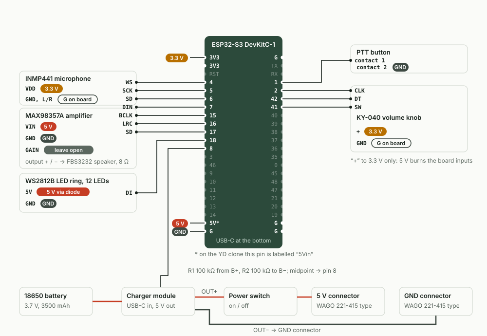

[Русский](../BUILD.md) · **English**

# Building the radio

From buying the parts to closing the back cover. Flashing, Wi-Fi and the bridge are covered separately: [Flashing and setup](SETUP.md) and [Your own bridge](BRIDGE.md).


The radio is a 68 × 38 × 170 mm bar:

- **front** — the speaker behind a white lens disc; a ring of 12 LEDs glows through the disc around the speaker grille; at the bottom — the microphone hole;
- **left side** (as seen from the front) — the PTT ("push-to-talk") button;
- **top** — the volume knob, the on/off power switch and a lanyard loop;
- **bottom** — the USB-C socket for charging.

All the hardware is mounted to the front shell of the case; the back cover is just a cover: not a single wire goes to it. The case prints without supports. There is no glue or tape inside: everything is held by self-tapping screws, snap-fits and slots. Glue is needed only for the white lens disc.

**Order of work:** buy the parts → print the case → flash the board → solder the sub-assemblies on the bench → assemble in the case → test → close.

Contents:

1. [Parts for one radio](#1-parts-for-one-radio)
2. [Printing the case](#2-printing-the-case)
3. [Wiring diagram](#3-wiring-diagram)
4. [Assembling the case](#4-assembling-the-case)

---

## 1. Parts for one radio

Prices are approximate, in rubles, from Russian stores as of September 2026, excluding shipping. The stores are given only as examples: all of these parts are common and the same ones can be bought anywhere (AliExpress etc.), as long as the dimensions match (see the list below).

| Part | Qty | ≈ Price | Where to buy (example) |
|---|---|---|---|
| ESP32-S3-DevKitC-1 N16R8 board, pins already soldered | 1 | 816 ₽ | [Ozon](https://www.ozon.ru/product/otladochnaya-plata-esp32-s3-devkitc-1-n16r8-wi-fi-bluetooth-usb-c-dlya-arduino-esp-idf-micropython-5648908176/) |
| INMP441 microphone (digital, round board) | 1 | 600 ₽ | [Ozon](https://www.ozon.ru/product/modul-vsenapravlennogo-mikrofona-na-inmp441-mems-i2s-4314549062/) |
| MAX98357A amplifier, 3 W | 1 | 180 ₽ | [duino.ru](https://duino.ru/usilitel-moshchnosti-3-vt-s-tsap-dac-i-shinoy-i2s/) |
| FBS3232 speaker, 8 Ω, 3 W, 32 × 32 mm | 1 | 470 ₽ | [Chip-Dip](https://www.chipdip.ru/product/fbs3232-8-om-3vt-32-32-14.7mm-bez-markirovki-dinamik-fbele-9001621604), item 9001621604 |
| WS2812B 12-LED ring, Ø50 mm | 1 | 466 ₽ | [Ozon](https://www.ozon.ru/product/koltso-iz-12-adresnyh-svetodiodov-ws2812b-714069208/) |
| KY-040 volume knob (rotary encoder with push button) | 1 | ≈ 113 ₽ (set of 3 — 338 ₽) | [Ozon](https://www.ozon.ru/product/modul-povorotnogo-enkodera-hw-040-ky-040-5v-20-shagov-na-oborot-dlya-arduino-3-sht-1509157901/) |
| PBS-28B-2 vandal-resistant push button, 16 mm | 1 | 260 ₽ | [Chip-Dip](https://www.chipdip.ru/product/pbs-28b-2-d-16-mm-steel-knopka-antivandalnaya-9000219084), item 9000219084 |
| MTS-101 mini toggle switch | 1 | 55 ₽ | [Chip-Dip](https://www.chipdip.ru/product/mts-101-on-off-mikrotumbler-spst-3a-250v-20-mom-ruichi-9000344178), item 9000344178 |
| "Power Bank Mini" charger module, USB-C input, 5 V 2 A output | 1 | 159 ₽ | [Ozon](https://www.ozon.ru/product/modul-power-bank-mini-s-gnezdom-type-c-5v-2a-arduino-561634064/) |
| 18650 battery, e.g. EVE INR18650-35V, 3500 mAh | 1 | 380 ₽ | [Chip-Dip](https://www.chipdip.ru/product/eve-inr18650-35v-akkumulyator-li-ion-18650-3500mah-10a-9001581130), item 9001581130 |
| 1 × 18650 battery holder with leads | 1 | 79 ₽ | [Chip-Dip](https://www.chipdip.ru/product/kls5-18650-l-fc1-5216-batareynyy-otsek-1x18650-9000296086), item 9000296086 |
| SMK 221-415 5-way lever connector (WAGO 221-415 type) | 2 | 33 ₽ × 2 | [Chip-Dip](https://www.chipdip.ru/product/smk-221-415-klemma-stroitelno-montazhnaya-5pin-kvt-9001187576), item 9001187576 |
| Female-female jumper wires, 20 cm, set of 40 | 1 set (≈ 30 used) | 211 ₽ (price when buying 3 sets or more) | [Chip-Dip](https://www.chipdip.ru/product/soedinitelnye-provoda-mama-mama-40-sht-20-sm-shleyf-iz-9001322249), item 9001322249 |
| 100 kΩ resistor, 0.25 W | 2 | 6 ₽ × 2 | [Chip-Dip](https://www.chipdip.ru/product/cf-25-s1-4-0.25vt-100-kom-5-rezistor-uglerodistyy-9549), item 9549 |
| 1N4007 diode | 1 | 6 ₽ | [Chip-Dip](https://www.chipdip.ru/product/1n4007-diod-vypryamitelnyy-1a-1000v-do-41-do-204ac-diotec-9000461664), item 9000461664 |
| Countersunk wood screw 3 × 12: 4 for the back cover + 2 for the battery holder | 6 (pack of 40) | 45 ₽ per pack | [Chip-Dip](https://www.chipdip.ru/product/0125030012p300004010-shurup-po-derevu-potay-shlits-steelrex-9000688284), item 9000688284 |
| Self-tapping screw 3 × 10 for wood or plastic: speaker shelf, board clamp, mic clamp plate | 5 | — | any hardware store |
| Heat-shrink tubing, set of assorted diameters | ≈ 10 pieces of 15 mm | 150 ₽ per set | [Chip-Dip](https://www.chipdip.ru/product/xbt-universal-nabor-termousadochnoy-trubki-100m-21-sht-xibo-9002098269), item 9002098269 |
| PLA filament for the case + white PLA or PETG for the white lens disc | ≈ 145 g | ≈ 220 ₽ (at 1,500 ₽ per kg) | any |
| 2.5 mm cable ties — optional, for the wire bundle | 2 | — | any |

**Total ≈ 4,200 ₽ per radio** if you build three at once (the sets and packs are split three ways). A single radio on its own costs ≈ 4,500 ₽: the volume knob, heat-shrink and screws are sold in sets. The 3 × 10 self-tapping screws and the cable ties are not included in the total.

### What matters when buying

The case is designed around specific dimensions. If your part is different, compare it with this list. If it doesn't match, change the number in the header of [`cad/radio_handheld.scad`](../../cad/radio_handheld.scad) and export the STL again (see [section 2](#if-you-need-to-modify-the-case)).

- **ESP32-S3 board.** The seat is for a 63 × 28 mm board with two rows of 22 pins (the YD-ESP32-S3 clone; on it the 5V pin is labelled "5Vin"). The firmware needs 4 MB of flash or more, so both N8 and N16R8 will do. Pin numbers are the same on the original DevKitC-1 and on the clones.
- **INMP441 microphone** — a round Ø13.4 mm board, two columns of 3 pins: SD·VDD·GND and SCK·WS·L/R.
- **MAX98357A amplifier** — a 17.3 × 18.8 mm board, without the screw terminal block.
- **Speaker** — 32 × 32 mm flange, 14.7 mm deep, Ø27.3 mm magnet.
- **WS2812B ring** — Ø50 mm outside, Ø36 mm inside, 2.5 mm thick including the contact pads.
- **KY-040 volume knob** — M7 bushing with 12 mm of thread, Ø5.8 mm shaft with a 4.2 mm flat (a D-shaped flat cut). If your shaft has fine knurling instead of a flat, you will have to adjust the knob cap to fit.
- **MTS-101 power switch** — M6 thread, body behind the panel 14 × 12.7 × 7.8 mm.
- **PBS-28B-2 button** — M16 thread, takes up Ø14.6 × 20.3 mm inside the case, screw terminals.
- **Charger module** — 20 × 26 × 4 mm, USB-C socket on the short edge. Inside it works like a power bank: if the radio draws very little current, the module may decide the load has been disconnected and cut the power. That's why «Экономия аккумулятора» (Battery saving) is off by default in the radio's settings — don't turn it on unless you need to.
- **18650 holder** — 77.5 × 20.5 × 21 mm, two Ø3 holes in the bottom, 55 mm apart.
- **SMK 221-415 lever connectors** — 19.4 × 29.8 × 9.6 mm.

### Tools

- 40–60 W soldering iron, flux-core solder;
- multimeter;
- side cutters, utility knife, round needle file — to clean up holes after printing;
- Pz1 cross-head screwdriver;
- clear glue: «Момент Кристалл» (Moment Crystal, a clear contact adhesive) or superglue (not hot glue) — for the white lens disc;
- a hot-air gun, or a lighter as a last resort — for heat-shrink;
- a USB-C cable that carries data (not a charge-only one) — for flashing;
- any USB-C charger — to charge the radio.

---

## 2. Printing the case

All STL files are in the [`stl/`](../../stl) folder. An STL is a file with the 3D shape of a part; it is opened in a slicer (a program that "slices" the model into layers for the printer). The parts are already rotated the way they should be placed on the build plate: **do not rotate them**. No supports are needed.

### Required parts — for one radio

| File | What it is | Orientation on the plate | Size, mm | ≈ g |
|---|---|---|---|---|
| [`front.stl`](../../stl/front.stl) | **Front shell**: face, sides, top and bottom in one piece; inside are the seats and posts for all the hardware | face down | 68 × 177 × 36 | 89 |
| [`back.stl`](../../stl/back.stl) | **Back cover**, 4 countersunk 3 × 12 screws | outer side down | 68 × 170 × 4 | 32 |
| [`shelf.stl`](../../stl/shelf.stl) | **Speaker shelf**: clamps the speaker together with the LED ring and the disc, holds both lever connectors; 2 self-tapping screws 3 × 10 | plate down | 60 × 32 × 7 | 9 for all four |
| [`spk_puck.stl`](../../stl/spk_puck.stl) | **Speaker puck**: presses on the magnet, its pin goes into the hole in the shelf | flat | Ø20 × 5 | ↑ |
| [`dk_arm.stl`](../../stl/dk_arm.stl) | **ESP board clamp**: holds the board down in the middle; 1 self-tapping screw 3 × 10 | bar down | 24 × 12 × 12 | ↑ |
| [`mic_cap.stl`](../../stl/mic_cap.stl) | **Mic clamp plate**: sits between the two columns of the microphone's pins; 2 self-tapping screws 3 × 10 | bar down | 6.5 × 40 × 9 | ↑ |
| [`spacer.stl`](../../stl/spacer.stl) | **Spacer** between the LED ring and the speaker | flat | Ø50 × 3 | 7 for both |
| [`knob.stl`](../../stl/knob.stl) | **Knob cap** for the volume knob | top down | Ø20 × 14 | ↑ |
| [`lens.stl`](../../stl/lens.stl) | **White lens disc** for the speaker. Print it in **white**: the LED ring shines through it | flat | Ø54 × 1.6 | 4.5 |

The case set without the disc takes **≈ 140 g of filament and ≈ 5 h 45 min** on a Bambu Lab P2S ("0.16mm High Quality" profile, time including heat-up and bed calibration). On a 256 × 256 mm plate the whole set prints in one go; the longest part, the front shell, needs a plate of at least 180 mm.

### Test pieces — optional

You don't have to print them, but they quickly show whether your printer and your parts fit before you spend 5–6 hours on the case.

| File | What it checks |
|---|---|
| [`edge_test.stl`](../../stl/edge_test.stl) | A 68 × 36 × 12 mm piece of the front shell with a rounded edge and lettering: how your printer handles the edge at the face and the stencil letters. |
| [`shaft_gauge.stl`](../../stl/shaft_gauge.stl) | Volume knob shaft gauge: three D-shaped holes, numbers 1, 2, 3 cut into the top. No. 1 — Ø6.2 with a 4.6 flat; No. 2 — Ø6.35 / 4.75; No. 3 — Ø6.5 / 4.9. The knob cap `knob.stl` is made for No. 2. If a different hole fits snugly but without force, enter its numbers in `shaft_d` and `shaft_flat` in `cad/radio_handheld.scad` and export the knob cap again. |
| [`coupon.stl`](../../stl/coupon.stl) | An 84 × 72 × 2.4 mm plate with holes for the white lens disc, the button, the power switch, the volume knob and the microphone: for test-fitting the parts you bought. |
| [`enc_spacer.stl`](../../stl/enc_spacer.stl) | 6 spacer rings 3 mm thick (for three radios). Spares: needed only if the bushing thread on your volume knob is longer than usual. The ring goes over the bushing from inside the case, between the volume knob and the wall. |

The edge test piece, the shaft gauge and the knob cap together — ≈ 16 g and ≈ 47 min.

### Print settings

- filament — PLA, any colour for the case; the white lens disc — **white** PLA or PETG;
- 0.4 mm nozzle, **0.16 mm** layer;
- **3 walls**, **15 %** infill;
- supports **off**;
- plate — textured PEI: its pattern will end up on the face of the radio. A smooth plate works too.

The board clamp and the mic clamp plate have one-layer-thick "ears" at the bottom: they hold the small part on the plate; snap them off after printing. If the mic clamp plate still lifts off the build plate, print it separately with a 5 mm brim.

The holes in the walls for the button, the volume knob and the power switch are teardrop-shaped with the point towards the back: when printing face down, their top doesn't sag. If a threaded bushing goes in tight, run a round needle file through the hole.

### Slicing from the command line (Bambu Studio)

If you are on macOS, Bambu Studio is in the Applications folder and your printer is a Bambu Lab P2S, the script [`tools/make_print.sh`](../../tools/make_print.sh) will slice ready-to-print plates by itself:

```bash
tools/make_print.sh                    # all plates → print/ folder
ONLY=1_ tools/make_print.sh            # only plates whose name contains "1_"
PROFILE="0.16mm Standard @BBL P2S" tools/make_print.sh   # a different print profile
```

You will get `print/*.3mf` files with time and gram estimates: `0_пробник_кромки_вала` (edge and shaft test pieces), `1_рация_v3_комплект` (radio v3, full set), `2_планка_микрофона_x2` (mic clamp plate ×2, with brim), `3_белый_диск_x3` (white lens disc ×3), `4_рация_белая_комплект_с_диском` (white radio, full set with the disc). Open the file you need in Bambu Studio and send it to print. With a different printer or slicer, just open the STLs from `stl/` and apply the settings from the list above.

### If you need to modify the case

The case is a parametric [OpenSCAD](https://openscad.org) model in a single file: [`cad/radio_handheld.scad`](../../cad/radio_handheld.scad). All the dimensions of the bought parts and their positions are numbers in the file header. You need a recent OpenSCAD build (snapshot) with the Manifold engine. The lettering on the face is set in the Impact font: if it's not installed on your system, OpenSCAD will substitute another one, and the stencil bridges in the letters may shift.

Export the STLs again (from the project root):

```bash
for p in front back shelf spk_puck dk_arm mic_cap knob; do
  openscad --backend manifold --export-format binstl -D "part=\"${p}_print\"" -o "stl/$p.stl" cad/radio_handheld.scad
done
for p in lens spacer shaft_gauge coupon edge_test; do
  openscad --backend manifold --export-format binstl -D "part=\"$p\"" -o "stl/$p.stl" cad/radio_handheld.scad
done
openscad --backend manifold --export-format binstl -D 'part="enc_spacer_print"' -o stl/enc_spacer.stl cad/radio_handheld.scad
```

After any change, run the four model checks: `check_inside` (parts don't touch each other), `check_walls` (parts don't intrude into the walls), `check_lid` (the back cover fits in place), `check_parts` (the clamping parts don't cut into anything). Each must give an **empty** result — OpenSCAD will report that the object is empty:

```bash
for c in check_inside check_walls check_lid check_parts; do
  openscad --backend manifold -D "part=\"$c\"" -o check.stl cad/radio_handheld.scad
done
```

The part measurements the model is built from are in [`cad/measurements.md`](../../cad/measurements.md).

---

## 3. Wiring diagram



**How to read the diagram.** The board's pin numbers are as printed on the board itself when you hold it **labels facing you, USB connectors at the bottom**: the left row starts with 3V3, the right row with G. "Pin 4" is the pin labelled "4", not the fourth pin in the row. Labels at the power pins: "5 V" and "GND" — the wire goes into a lever connector; "3.3 V" — to a 3V3 pin on the board (there are two); "G on board" — to a G pin of the board itself, **not into a lever connector**.

Almost all signal wires are **female-female jumper wires**: they have plastic housings at the ends that slip onto a pin, no soldering. Only the parts without pins are soldered: the battery holder leads, the charger module, the LED ring, the power switch, the speaker, the diode and the two resistors of the battery voltage divider. Plus the pin headers (strips of pins) on the microphone and the amplifier, if the seller didn't solder them.

### Board pins

The source of truth is [`firmware/walkie/config.h`](../../firmware/walkie/config.h). If you move a wire, change the number there as well and rebuild the firmware.

| Board pin | Goes to | Why |
|---|---|---|
| 4 | microphone WS | I2S is a three-wire digital audio bus; WS is the left/right channel clock |
| 5 | microphone SCK | I2S, bit clock |
| 6 | microphone SD | I2S, data from the microphone |
| 7 | amplifier DIN | I2S, data to the speaker |
| 15 | amplifier BCLK | I2S, bit clock |
| 16 | amplifier LRC | I2S, channel clock |
| 17 | amplifier SD | amplifier enable: the firmware shuts it off during silence so the speaker doesn't hiss |
| 18 | LED ring DI (DIN) | LED control |
| 1 | PTT button, contact 1 | the button's second contact goes to GND |
| 2 | volume knob CLK | rotation |
| 42 | volume knob DT | rotation |
| 41 | volume knob SW | knob press |
| 8 | middle of the battery voltage divider | the firmware measures the battery voltage |
| 3V3 (first) | microphone VDD | 3.3 V supply |
| 3V3 (second) | volume knob "+" | supply **3.3 V only** |
| G, right row, top | microphone GND | |
| G, right row, second from bottom | microphone L/R | L/R to ground — the microphone works on the left channel |
| G, right row, bottom | volume knob GND | |
| 5V (5Vin on the clone), left row, second from bottom | 5 V lever connector | the board is powered from the charger module |
| G, left row, bottom | GND lever connector | |

### Power

- Battery holder leads: red → **B+** of the charger module, black → **B−**.
- Battery voltage divider: a 100 kΩ resistor from **B+** to the "middle", a second 100 kΩ from the "middle" to **B−**, the "middle" → pin **8**.
- Charger module **OUT+** → power switch → **5 V lever connector**.
- Charger module **OUT−** → **GND lever connector**.

The charger module is always connected to the battery; the power switch only breaks the 5 V output. That's why the radio charges even with the power switch off.

### Lever connectors: two common buses

The SMK 221-415 is a connector with 5 slots under levers. Inside, all the slots are joined by a single copper plate: everything inserted into one connector is connected together. The radio has two such common nodes, so there are **two lever connectors per radio**:

- **5 V connector** (the 5 V bus) — 4 wires, one slot free: from the power switch (charger module OUT+ is on it) · board 5V · amplifier Vin · LED ring 5V through the diode;
- **GND connector** (the GND bus) — 5 wires, full: charger module OUT− · board G (left row, bottom) · amplifier GND · LED ring GND · button contact 2.

The microphone and the volume knob don't go into the lever connectors: their ground and supply are taken from the pins of the board itself.

> **Never put a 5 V wire and a GND wire into the same lever connector.** That's a short circuit: the charger module will shut down or burn out. If you only have one lever connector for now, use it for GND, and twist the four 5 V wires together, solder them and cover with heat-shrink.

**How to put a thin wire into a lever connector.** The core of a female-female jumper wire is thinner than the connector can hold reliably. Strip the end by **20–22 mm**, fold the core **in half** and twist it tightly — you'll get a double tip of 10–11 mm. Open the lever, push the wire all the way in, close the lever and tug: the wire must not come out. There's no need to solder the tip. Without this, the radio may reboot by itself when shaken, and a fault like that is very hard to track down later.

### Battery voltage divider

The radio monitors the charge via pin 8, and that pin tolerates no more than 3.3 V. The battery gives up to 4.2 V. Two identical 100 kΩ resistors in series divide the voltage exactly in half, so the point between them sees no more than 2.1 V. The current through them is ≈ 0.02 mA — they don't drain the battery.

1. Twist one leg of each of the two resistors together — this is the "middle".
2. Cut one connector off a female-female jumper wire, strip 5 mm, twist it onto the middle and solder all three; heat-shrink on top.
3. Solder the free leg of the first resistor to the **B+** pad of the charger module (where the battery's red wire is), and the free leg of the second to **B−** (where the black wire is).
4. Slip the wire's connector onto pin **8** of the board while the board is still outside the case. Holding the board labels facing you, USB at the bottom, it's the 12th pin from the top in the left row.

Resistors have no "plus", they can go either way round. Connect to **B+ / B−**, not to OUT+. Trim the legs with side cutters to 5–8 mm and cover every solder joint with heat-shrink: a bare leg from B+ must not touch other parts. The radio works without the divider, but it won't know the battery is running low.

### All the wires of one radio

Length is how much wire is needed along its route inside the case, with ≈ 3 cm to spare. A wire that goes into a lever connector or to a solder joint is cut to fit in place. Wires with connectors on both ends can't be shortened: fold the excess next to a cable-tie anchor in the channel and tie it up (you can buy a 10 cm female-female set instead — a radio takes 9 of them).

"Fold in half" refers to the end that goes into a lever connector: strip 20–22 mm and fold as described above.

| No. | From | To | With | Length |
|---|---|---|---|---|
| | **INMP441 microphone** | | | |
| 1 | pin 4 | WS | female-female jumper wire | ≈ 10 cm |
| 2 | pin 5 | SCK | female-female jumper wire | ≈ 10 cm |
| 3 | pin 6 | SD | female-female jumper wire | ≈ 10 cm |
| 4 | 3V3 (first) | VDD | female-female jumper wire | ≈ 10 cm |
| 5 | G, right row, top | GND | female-female jumper wire | ≈ 10 cm |
| 6 | G, right row, second from bottom | L/R | female-female jumper wire | ≈ 15 cm |
| | **MAX98357A amplifier** (pins in order: LRC, BCLK, DIN, GAIN, SD, GND, Vin) | | | |
| 7 | pin 7 | DIN | female-female jumper wire | ≈ 10 cm |
| 8 | pin 15 | BCLK | female-female jumper wire | ≈ 10 cm |
| 9 | pin 16 | LRC | female-female jumper wire | ≈ 10 cm |
| 10 | pin 17 | SD | female-female jumper wire | ≈ 10 cm |
| 11 | 5 V connector | Vin | female-female jumper wire, cut off the connector at the lever-connector end, fold in half | ≈ 20 cm |
| 12 | GND connector | GND | female-female jumper wire, cut off the connector at the lever-connector end, fold in half | ≈ 20 cm |
| 13 | speaker "+" | amplifier "+" pad | a whole wire from the set, connectors cut off; soldered at both ends | ≈ 17 cm |
| 14 | speaker "−" | amplifier "−" pad | the same. GAIN is not connected to anything | ≈ 17 cm |
| | **WS2812B LED ring** | | | |
| 15 | pin 18 | DI (input) | female-female jumper wire, cut off one connector, soldered to the ring | ≈ 15 cm |
| 16 | 5 V connector | ring 5V | wire, connectors cut off; a 1N4007 diode spliced in, **stripe towards the ring**, soldered + heat-shrink; the end that goes into the lever connector folded in half | ≈ 14 cm |
| 17 | GND connector | ring GND | female-female jumper wire, cut off the connector at the lever-connector end, fold in half; soldered to the ring | ≈ 14 cm |
| | **PBS-28B-2 PTT button** | | | |
| 18 | pin 1 | contact 1 | female-female jumper wire, cut off one connector; to the button — under the screw | ≈ 15 cm |
| 19 | GND connector | contact 2 | wire, connectors cut off; to the button — under the screw, the end that goes into the lever connector folded in half | ≈ 15 cm |
| | **KY-040 volume knob** | | | |
| 20 | pin 2 | CLK | female-female jumper wire, the other connector onto the volume knob pin | ≈ 20 cm |
| 21 | pin 42 | DT | the same | ≈ 20 cm |
| 22 | pin 41 | SW | the same | ≈ 20 cm |
| 23 | 3V3 (second) | + | the same — **3.3 V only** | ≈ 20 cm |
| 24 | G, right row, bottom | GND | the same | ≈ 20 cm |
| | **Board power** | | | |
| 25 | 5V / 5Vin | 5 V connector | female-female jumper wire, cut off the connector at the lever-connector end, fold in half | ≈ 15 cm |
| 26 | G, left row, bottom | GND connector | female-female jumper wire, cut off the connector at the lever-connector end, fold in half | ≈ 15 cm |
| 27 | pin 8 | middle of the divider | female-female jumper wire, cut off one connector, soldered to the resistors | ≈ 10 cm |
| | **Battery and charging** | | | |
| 28 | 18650 holder, red | charger module B+ | the holder's own lead, soldered | — |
| 29 | 18650 holder, black | charger module B− | the holder's own lead, soldered | — |
| 30 | charger module B+ | resistor → middle → resistor → B− | soldered with the resistor legs | — |
| 31 | charger module OUT+ | power switch, one terminal | a whole wire, connectors cut off; soldered at both ends | ≈ 20 cm |
| 32 | power switch, second terminal | 5 V connector | wire, connectors cut off; soldered to the power switch, the end that goes into the lever connector folded in half | ≈ 10 cm |
| 33 | charger module OUT− | GND connector | wire, connectors cut off; soldered to the module, the end that goes into the lever connector folded in half | ≈ 17 cm |

### Easy places to make a mistake

- **KY-040 volume knob — 3.3 V only.** The module has resistors that pull its pins up to its "+". At 5 V, excess voltage reaches the board's inputs and they will burn out.
- **The microphone is also 3.3 V only** (VDD to 3V3).
- **Solder all six microphone pins.** A typical fault is an unsoldered SCK: the radio transmits silence, and the bridge reports «в передаче одна тишина — проверьте микрофон» ("only silence in the transmission — check the microphone").
- **1N4007 diode — stripe towards the ring.** The diode lowers the LED ring's supply to about 4.3 V, and then the board's 3.3 V signal is reliably enough for it. Without the diode the ring may flash the "wrong" colours.
- **The wire from pin 18 goes to the DI (input) pad of the ring**, not to DO (output).
- **Don't connect the speaker's minus to GND:** both outputs of this amplifier are active.
- **Leave the amplifier's GAIN pin unconnected:** the volume is set by the volume knob.
- **The divider goes to B+ / B−,** not to OUT+.
- **The 5 V connector and the GND connector are two separate lever connectors.** A 5 V wire in the GND connector is a short circuit.
- **Wire ends in the lever connectors are folded in half.** A single thin core holds poorly.

---

## 4. Assembling the case


**What goes where.** Everything is assembled in the front shell. It lies face down on the table, and you look into it from the back, as in the picture. So the side with the PTT button is on the **right** in the picture and on the table (even though from the front it's the left side). From here on, places are named "on the button side" and "on the other side".

In the picture, circles with a cross are self-tapping screws: 2 at the speaker shelf, 1 at the board clamp, 2 at the battery holder, 2 at the mic clamp plate. Empty circles in the corners are the posts for the 4 back-cover screws. The dashed lines show what is hidden under the shelf: the speaker and the LED ring cup, and at the top — the volume knob's board.

### Step 1. Flashing — before assembly

Flash and set up the board while it's still out of the case: later its USB-C socket will end up inside. How — in the [flashing guide](SETUP.md#1-flashing). After that, the radio is updated over the air (OTA), through the bridge, or with a file uploaded on its own page.

**Testing the microphone on the bench (optional).** First solder the pin header onto the microphone (step 2, item 1). Connect the flashed board to the microphone with wires 1–6 and plug the board into the computer with the cable. Open a serial monitor (for example, in Arduino IDE: speed 115200, line ending "New Line", otherwise the command won't run; more in [USB commands](SETUP.md#5-usb-commands)) and send the command `micraw`. The board will reply with a line `OK micraw кадров … L: … R: …` (кадров = frames). The numbers after `L:` should be noticeably different and change if you clap nearby. `L: 0…0` or two identical numbers means the microphone is silent: check the soldering of the pins (most often SCK) and the L/R → G wire.

### Step 2. Soldering on the bench

All of this is done before mounting in the case: afterwards you can no longer reach the button's screws or the power switch. Slide the heat-shrink (a ≈ 15 mm piece) onto the wire **before** soldering — you won't get it on afterwards. After soldering, slide the tube over the joint and heat it with a hot-air gun or the side of the soldering tip.

1. **Pin headers** on the microphone and the amplifier, if the seller didn't solder them. On the microphone the pins go on the side **without components** (that's where the sound hole is), on the amplifier — on the side **with components**. Snip off the pin tails on the other side. Solder every pin.
2. **Speaker:** two whole wires ≈ 17 cm from the speaker's solder tabs to the "+" and "−" pads of the amplifier (wires 13, 14).
3. **LED ring:** three wires — DI, 5V with the diode stripe towards the ring, GND (wires 15–17).
4. **Battery and divider:** the holder leads to B+ and B− of the charger module, and the battery voltage divider to the same pads (wires 27–30).
5. **Power switch:** module OUT+ — with a ≈ 20 cm wire to one terminal of the power switch; to the second terminal — the wire that will go into the 5 V connector; to OUT− — a ≈ 17 cm wire to the GND connector (wires 31–33).
6. **Button:** two wires under the screws (wires 18, 19). Bend the core into a hook clockwise — then the screw pulls it in as it tightens instead of pushing it out.
7. **The volume knob needs no soldering:** the housings of the female-female jumper wires slip straight onto its pins, and there is a pocket for them in the case wall. Don't shorten the pins. If the housings still don't fit, cut them off and solder the wires directly to the pins.

### Step 3. Parts into the front shell — in this order

The front shell lies face down on the table.

1. **White lens disc.** 3–4 drops of clear glue (not hot glue) on the chamfer of its seat, then press the disc in from the outside, flush with the face.
2. **LED ring, spacer, speaker.** From the inside, place the **LED ring** into the cup with the LEDs towards the disc, the pads with the wires facing down (towards the ESP board). On top of it — the **spacer**, with its cut-out in the same direction, towards the pads. Into its square seat goes the **speaker**, flange first, solder tabs to the side. Don't glue anything: the whole stack will later be clamped by the speaker shelf.
3. **Volume knob** — into the hole on top, closer to the middle. Bushing from the inside, pin header towards the other side, into the free corner, away from the power switch. Screw the nut on from the outside.
4. **Power switch** — into the hole on top on the button side, across the case: the lever moves towards the face and towards the back.
5. **Button** — into the hole in the side, tighten the nut from the inside.
6. **Charger module** — into the slot at the bottom on the button side: on its edge, USB-C socket down into the window in the bottom. Divider resistors towards the button wall: on that side the slot is open at the top. The wires from its pads point towards you.
7. **Microphone** — into the little ring at the bottom in the middle, components (the capsule) towards the face. The two columns of pins will sit left and right of the centre. First slip the housings of wires 1–6 onto the pins, then lay the **mic clamp plate** between the columns and drive in 2 self-tapping screws 3 × 10 (no longer than 10 mm, or they'll pierce the face).
8. **Amplifier** — into the seat at the bottom on the other side, pins towards you. Pin header up or down — whichever suits the wires. First tuck the board edge that's next to the case wall under the lip, then press the other edge (towards the microphone): it will slide down the ramp and snap under the catch, the wall there is springy. Don't press straight down on both edges.
9. **Battery holder**, still without the battery, — onto the two posts on the other side: 2 screws 3 × 12 from the inside, through its holes in the bottom (**no longer than 12 mm**). Don't lay wires over the holder: there is ≈ 2 mm to the back cover above it.
10. **ESP32-S3 board.** While the board is in your hands (labels facing you, USB at the bottom), slip on the connectors of wires 1–10, 15, 18, 20–27 — the pin numbers are visible now. Then turn the board module side towards the face of the radio and lay it into the seat on the button side **antenna down**: first tuck the two bottom corners under the lips, then lay the board on its support pads. The row with pins 3V3…8 and 5V will end up next to the wire channel, the row with pins 1, 2, 42, 41 — next to the button wall. Once the board is in place you can no longer count the pins: the labels are underneath and the rows have swapped sides. Put the **board clamp** with its hole over the post's pin and drive in 1 self-tapping screw 3 × 10 — it will hold the board down in the middle. You can take the board out at any time by undoing this screw.
11. **Speaker shelf.** Press the lever connectors into its seats levers up (towards you), with the wire-entry side towards the side walls of the case: the 5 V connector into the seat by the button wall (next to the power switch), the GND connector into the other one. Place the **speaker puck** on the speaker magnet flat side down, pin towards you. Put the shelf with its hole over the puck's pin, set it on the two posts at the sides and drive in 2 self-tapping screws 3 × 10 until the shelf bottoms out on the posts: the puck will clamp the speaker, and with it the LED ring and the white lens disc.

> **Antenna** — the part of the ESP32-S3 module without a metal shield; it sticks out past the edge of the board. Don't press wires or metal against it, and don't fold spare wire length next to it.

### Step 4. Wires

Connect the other ends according to the list, by number. Ends that go into lever connectors are folded in half. Where to route them:

- microphone and amplifier — short, to the row of board pins next to the channel;
- button wires — along the button wall; volume knob wires — over the board upwards and across the top to the volume knob, past the edge of the shelf on the other side;
- route the wires going into the lever connectors along the side walls, where the connectors have their entry holes: to the 5 V connector — along the button wall, to the GND connector — along the other wall. Under the shelf on each side there is a slot for a cable tie;
- OUT+ from the charger module to the power switch — along the button wall: above the board's connector housings, above the button and past the 5 V connector. OUT− to the GND connector — diagonally over the board and the channel;
- speaker wires — out from under the shelf (there is a gap above the magnet) into the channel and down the channel to the amplifier, around the housings on its pin header;
- tie the bundle in the channel at the cable-tie anchors with 2.5 mm cable ties, threading each tie under its anchor. Fold spare length next to an anchor, not next to the antenna (the bottom of the board).

### Step 5. Knob cap

Push the knob cap onto the shaft leaving a 1.5–2 mm gap above the end of the bushing, then press: there should be a click. That's the volume knob press, it mutes the sound.

### Step 6. Test before closing

**With a multimeter, battery not inserted.** In continuity mode, touch the probes to the second terminal of the power switch (the one that goes to the 5 V connector) and the OUT− pad of the charger module. A short beep followed by silence is normal: the capacitors are charging. A continuous beep means a short somewhere; first look for a 5 V wire in the GND connector.

**With a multimeter, battery inserted.** Insert the battery, plus as marked on the holder. The B+ and B− pads of the charger module should read 3.0–4.2 V, and the middle of the divider exactly half of that.

**Turn on the power switch** (if nothing lights up, flick it the other way). The LED ring will immediately flash **white**. Then:

- a radio that doesn't know any Wi-Fi yet will right away start slowly "breathing" **purple**: the RADIO-XXXX setup access point is open. That's as it should be; Wi-Fi is entered from a phone (see [Option 2. From a phone](SETUP.md#option-2-from-a-phone));
- a radio that already knows Wi-Fi will show a running **blue** light (searching for the network), and once connected to the bridge you will hear "tee-doo" and see short **green** flashes every 3 seconds.

While the back cover is open, take a minute to check what will be hidden later. No connection to the bridge is needed for this:

| What to do | What should happen | What it checks |
|---|---|---|
| Turn the volume knob | the LED ring shows the volume as a white bar, clicks in the speaker; clockwise — louder | volume knob, amplifier, speaker |
| Briefly press the knob | the bar turns purple — sound muted; press again — a click, the sound is back | the volume knob's push button |
| Press the PTT button with no connection to the bridge | a low beep and fast orange blinking ("no connection, can't talk") | PTT button |
| Hold the knob for 1–4 s and release | charge gauge: green (above 40 %), amber (16–40 %) or red (15 % and below). For the first 20 seconds after power-on — dim white: the charge is still being measured | battery voltage divider |

Once the radio is connected to the bridge, check the microphone too: press the PTT button — "beep-beep", the LED ring lights up red and "dances" in time with your voice. The other radio will hear you, and on the bridge status page this radio will be marked as talking.

**If something is wrong:**

| Symptom | What to check |
|---|---|
| The LED ring didn't light up at all within 10 seconds | power switch, wires in the 5 V connector, diode (stripe towards the ring), wire from pin 18 to DI, not to DO |
| The LED ring flashes the "wrong" colours | the diode in the ring's 5V wire, ring GND in the GND connector |
| No clicks or sounds | amplifier Vin and GND in the lever connectors, wires 7–10 on pins 7, 15, 16, 17, speaker wires on the amplifier's "+" and "−" |
| Volume changes the wrong way | tick «Регулятор крутится наоборот» (Volume knob turns the other way) on the radio settings page, or swap the CLK and DT wires |
| The volume knob doesn't respond | volume knob "+" on 3V3, its GND on the board's G, wires on pins 2, 42, 41 |
| The charge gauge is blue even though the radio is on battery | the radio doesn't see the divider: wire 27 on pin 8, resistors on B+ and B− |
| The bridge reports «в передаче одна тишина — проверьте микрофон» ("only silence in the transmission — check the microphone") | soldering of all the microphone pins (especially SCK), VDD on 3V3, L/R on G. If L/R is connected to 3.3 V, tick «Микрофон на правом канале» (Microphone on the right channel) on the radio settings page |
| The radio reboots by itself when shaken | wire ends in the lever connectors: are they folded in half, do they hold |
| The radio turns itself off when left idle for a long time | the charger module cuts off a load that's too small: check that «Экономия аккумулятора» (Battery saving) is off on the radio settings page |

Other symptoms and what to do about them are in [If something isn't working](TROUBLESHOOTING.md).

### Step 7. Close it

The back cover is just a cover; not a single wire goes to it. Lay it on top and check that no wire is resting on its rim. Drive in the four countersunk 3 × 12 screws — without force, it's plastic.

The radio is assembled. Next — Wi-Fi, the network key and the bridge: [Flashing and setup](SETUP.md) and [Your own bridge](BRIDGE.md).
